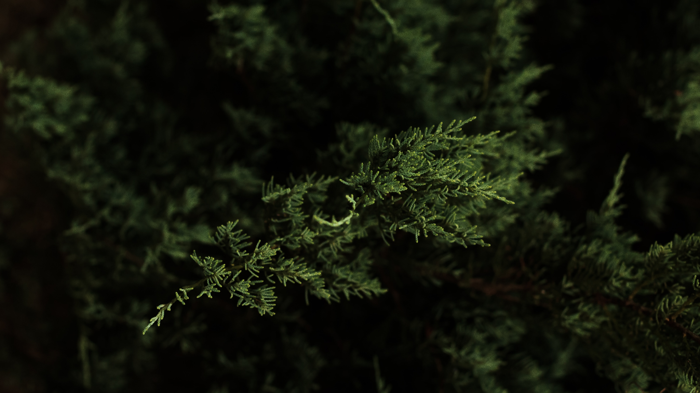
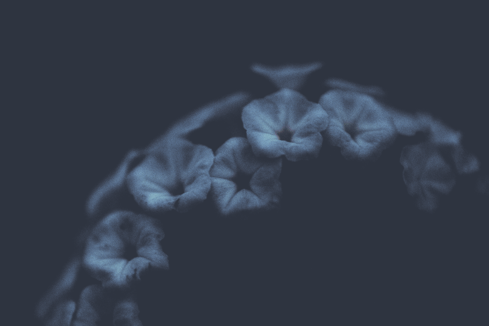
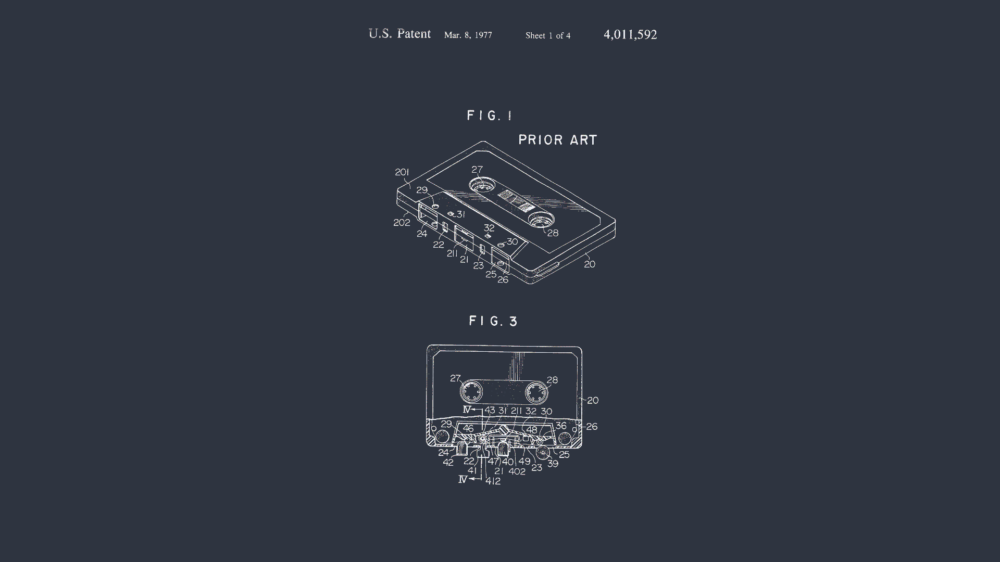
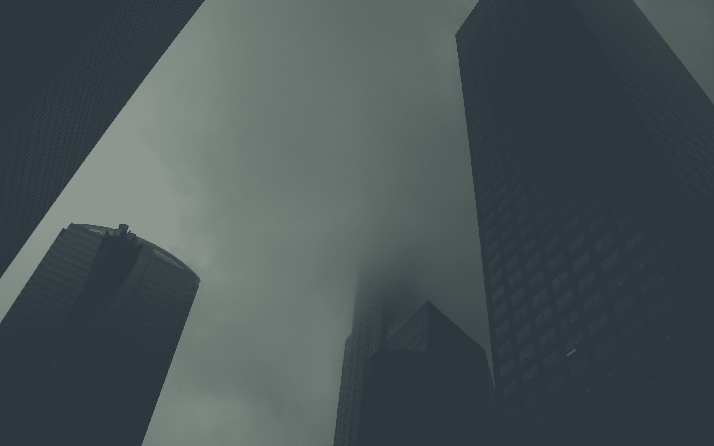
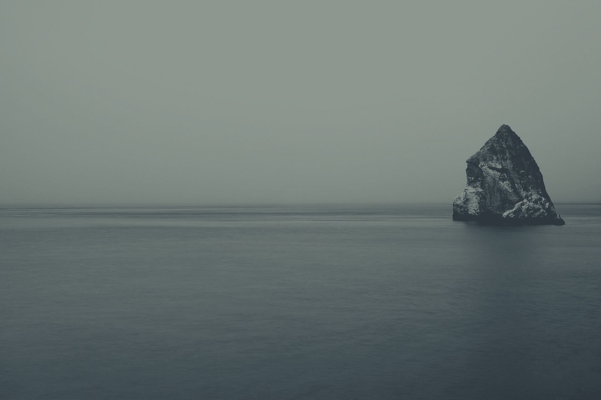

# DevFreitas' Rice (Niri + Noctalia)  🍚

A professional, aesthetic, and highly customized dotfiles setup for **Arch Linux** featuring **Niri** (a scrollable-tiling Wayland compositor) and **Noctalia** (a versatile desktop shell/bar). 

## Installation

The repository includes a convenient installation script that automates the entire setup process. 
> **Note**: This setup is intended for Arch Linux and assumes a minimal installation.

1. **Clone the repository:**
   ```bash
   git clone https://github.com/devfreitas/rice.git
   cd rice
   ```
2. **Make the script executable:**
   ```bash
   chmod +x install.sh
   ```
3. **Run the installer:**
   ```bash
   ./install.sh
   ```

### What does the installation script do?
1. Checks for and installs the `yay` AUR helper if you don't already have it.
2. Installs all required packages and dependencies (Niri, Noctalia, Ghostty, Alacritty, Zen Browser, Wayland utilities, etc.).
3. Creates the required directory structures in `~/.config/niri` and `~/.config/noctalia`.
4. Parses `dotfiles.md` using Python, extracts the configuration blocks dynamically (ignoring the markdown fluff), and writes them to their correct locations in your home folder.

---

## How It Works (Post-Installation)

Once installed, you can start the environment by logging out and selecting **Niri** from your Display Manager (like GDM, SDDM or Ly), or by typing `niri-session` directly from the TTY.

Here is a breakdown of the core components and how they function:

- **Niri (Wayland Compositor):** Niri uses a unique scrollable tiling layout. Instead of managing complex grids or trees, windows tile continuously to the right. You can scroll left and right through your windows seamlessly. It's configured heavily for aesthetics with rounded corners, beautiful drop shadows, and intuitive custom keybinds.
- **Noctalia (Desktop Shell):** This replaces traditional bars like Waybar. It acts as your top bar, application launcher (replacing wofi/rofi), lock screen, and system control center. The configurations for Noctalia handle the styling, modules, and plugins (like Catwalk and Pomodoro).
- **Ghostty & Alacritty:** The terminal emulators of choice, styled and optimized for modern and blazing-fast workflows.
- **Quickshell:** The underlying declarative framework used by Noctalia to render QML-based UI elements efficiently.


## Wallpapers

A collection of beautiful wallpapers is included in this setup. Here is a preview of the included backgrounds:

| | | |
|:---:|:---:|:---:|
|  |  |  |
|  |  |  |
|  |  |  |
|  |  |  |
|  |  |  |

---

## Keybindings

A few useful keybindings configured in `config.kdl` to get you started:
- `Mod + T`: Open Terminal (Ghostty)
- `Mod + D`: Open App Launcher (Noctalia)
- `Mod + B`: Open Zen Browser
- `Mod + E`: Open File Manager (Nautilus)
- `Mod + Space`: Toggle window overview
- `Mod + Q`: Close current window
- `Mod + Shift + E`: Quit Niri (Shows confirmation dialog)

*(Check `dotfiles.md` for the complete list of directional controls and workspace management bindings!)*

### Customizing Keybindings

If you want to change any of the default shortcuts (for example, if you prefer `firefox` or `brave` over `zen-browser`), you can easily do so by editing the Niri configuration file.

1. Open `~/.config/niri/config.kdl` in your favorite text editor.
2. Locate the `binds { ... }` section.
3. Find the line you want to change. For example, to change the browser shortcut from Zen to Firefox:
   ```kdl
   // Change this:
   Mod+B { spawn "zen-browser" ; }
   
   // To this:
   Mod+B { spawn "firefox" ; }
   ```
4. Save the file. Niri will automatically reload the configuration and apply your new keybindings instantly!

---

> Enjoy the rice! Feel free to modify and tweak it further to fit your exact needs.

---

### Thank You! ❤️

Thank you so much for using my dotfiles and checking out this rice! I hope it makes your Linux experience smoother, more aesthetic, and productive. If you like this project, consider giving it a ⭐ on GitHub, and feel free to open an issue or pull request if you have any ideas to improve it. Happy ricing!

---

> I changed some things, so I'll update later
